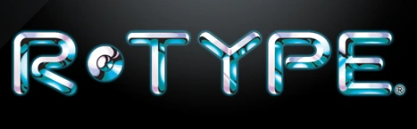

<h1 align="center">R-TYPE</h1>

## 👾 About

The goal of this project is to implement a multithreaded server and a graphical client for a well-known legacy video game called R-Type, using our own game engine design.

## 📖 Documentation

You can find more information about the project [here](https://github.com/R-TYPE-Polo/R-TYPE/wiki).

## 🧑‍💻 Student on the project

    <table>
        <td align="center" style="min-width: 150px; border: 2px solid; padding: 20px">
            <a href="https://github.com/4lrick">
                
                 
                <b>Alrick RUBIO</b>
            </a>
             
            

                <a href="https://github.com/EpitechPromo2026/B-CPP-500-BDX-5-2-rtype-jules.trolle/commits?author=4lrick" title="Code">👨‍💻</a>
                <a href="mailto:alrick.rubio@epitech.eu">✉️</a>
            

        </td>
        <td align="center" style="min-width: 150px; border: 2px solid; padding: 20px">
            <a href="https://github.com/JulesTrolle">
                
                 
                <b>Jules TROLLÉ</b>
            </a>
             
            

                <a href="https://github.com/EpitechPromo2026/B-CPP-500-BDX-5-2-rtype-jules.trolle/commits?author=JulesTrolle" title="Code">👨‍💻</a>
                <a href="mailto:jules.trolle@epitech.eu">✉️</a>
            

        </td>
        <td align="center" style="min-width: 150px; border: 2px solid; padding: 20px">
            <a href="https://github.com/GaetanRaux">
                
                 
                <b>Gaëtan RAUX</b>
            </a>
             
            

                <a href="https://github.com/EpitechPromo2026/B-CPP-500-BDX-5-2-rtype-jules.trolle/commits?author=GaetanRaux" title="Code">👨‍💻</a>
                <a href="mailto:dressley@gmail.com">✉️</a>
            

        </td>
        <td align="center" style="min-width: 150px; border: 2px solid; padding: 20px">
            <a href="https://github.com/skyli3spro">
                
                 
                <b>Quentin CHARPENTIER</b>
            </a>
             
            

                <a href="https://github.com/EpitechPromo2026/B-CPP-500-BDX-5-2-rtype-jules.trolle/commits?author=skyli3spro" title="Code">👨‍💻</a>
                <a href="mailto:quentin.charpentier@epitech.eu">✉️</a>
            

        </td>
        <td align="center" style="min-width: 150px; border: 2px solid; padding: 20px">
            <a href="https://github.com/Leandre17">
                
                 
                <b>Léandre GODET</b>
            </a>
             
            

                <a href="https://github.com/EpitechPromo2026/B-CPP-500-BDX-5-2-rtype-jules.trolle/commits?author=Leandre17" title="Code">👨‍💻</a>
                <a href="mailto:leandre.godet@epitech.eu">✉️</a>
            

        </td>
      <td align="center" style="min-width: 150px; border: 2px solid; padding: 20px">
            <a href="https://github.com/Leandre17">
                
                 
                <b>Mathieu de Coninck</b>
            </a>
             
            

                <a href="https://github.com/EpitechPromo2026/B-CPP-500-BDX-5-2-rtype-jules.trolle/commits?author=Leandre17" title="Code">👨‍💻</a>
                <a href="mailto:mathieu.de-coninck@epitech.eu">✉️</a>
            

        </td>
    </table>

